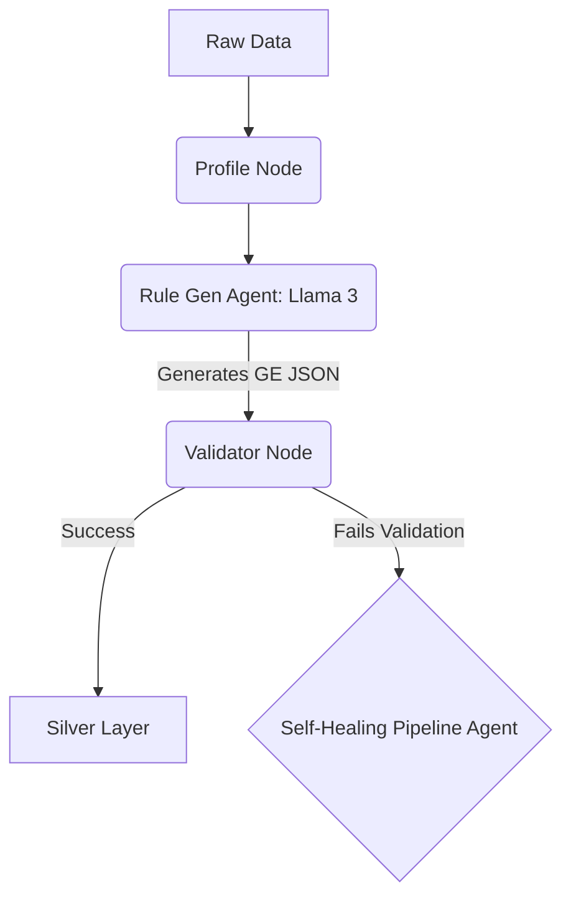
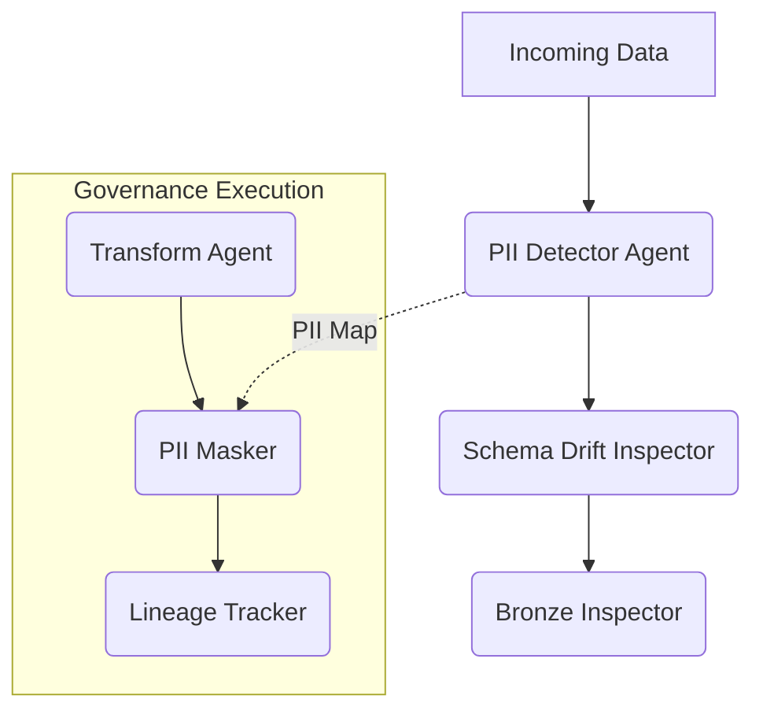
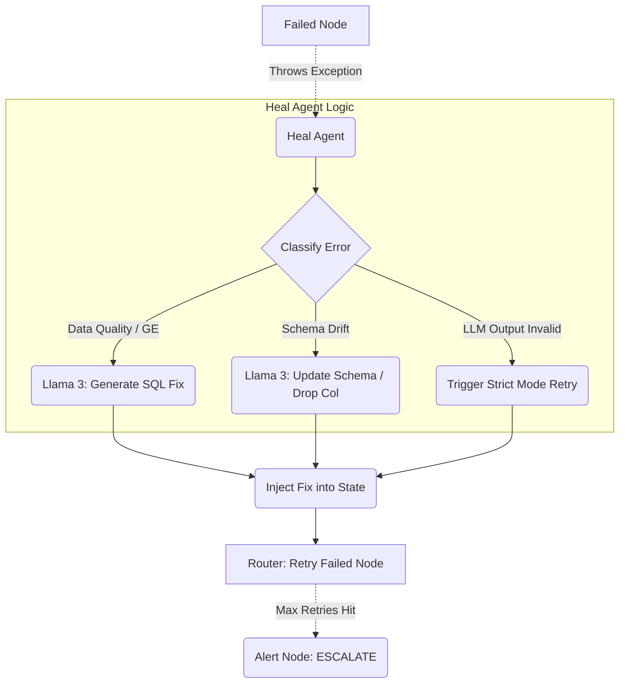

# Olist Agentic Pipeline: Hackathon Architecture Plan

This document maps our LangGraph nodes directly to the three core agents requested in the Hackathon Problem Statement (Option B). Use these exact diagrams for your presentation.

---

## 1. Ingestion Quality Agent (B1)
**Flow**: Profile → Generate Rules → Validate → Self-Heal
**Role**: Autonomously profiles the data, writes Great Expectations rules using an LLM, and runs them.

**Architecture Details**:
- **Profile Node**: Scans the dataset for row counts, columns, and sample rows.
- **Rule Gen Agent**: Prompts the **Llama 3.3** LLM with the schema to dynamically generate a JSON array of Great Expectations rules (e.g., `expect_column_values_to_not_be_null`).
- **Validator Node**: Compiles an Ephemeral Data Context and executes the GE rules against the Pandas dataframe.

---

## 2. Lineage & Governance Agent (B2)
**Flow**: SQL → Extract Lineage → Tag PII → Enrich Catalogue
**Role**: Scans all incoming data to detect PII, detect schema drifts, mask sensitive data, and record full data lineage.

**Architecture Details & Pre-Trained Models**:
- **PII Detector Agent (The Cascade)**: 
  - Uses exact string matching heuristics.
  - Uses Regex for Emails/Phones.
  - **Pre-Trained Model**: Uses **Microsoft Presidio (SpaCy `en_core_web_sm`)** to detect `PERSON`, `CREDIT_CARD`, and `LOCATION` via NLP embeddings.
  - **Pre-Trained Model**: Uses **Llama 3.3 LLM** as the ultimate fallback for unclassified columns.
- **Schema Drift Inspector**: 
  - **Pre-Trained Model**: Uses **Sentence-Transformers** (Local ML) and heuristic type mapping to assign Semantic Types (`EMAIL`, `TIMESTAMP`) rather than relying on Pandas types.
- **PII Masker**: Executes SHA-256 hashing on any column mapped as `HIGH` or `MEDIUM` risk.
- **Lineage Tracker**: Extracts the exact file paths and transformation steps, writing them to the Audit log.

---

## 3. Self-Healing Pipeline Agent (B3)
**Flow**: Detect Failure → Classify → Fix → Alert
**Role**: The emergency responder that catches any Validation errors, API errors, or Schema errors, classifies them, and writes code to fix them dynamically.

**Architecture Details**:
- **Error Detection**: LangGraph catches any `Exception` or `Success==False` flag from the Validator and routes to the Heal Agent.
- **Classification**: The Heal Agent categorizes the error (e.g., `data_quality_error`, `ge_config_error`, `invalid_llm_output`, `rate_limit`).
- **Dynamic Fix Generation**: Uses **Llama 3.3 LLM** to analyze the failing rows and write a Snowflake SQL `UPDATE` or `DELETE` statement to clean the bad data.
- **Retry Engine**: Updates the Pipeline State with the `fix_sql` and forces the pipeline to loop back and re-run the failed node up to 3 times before Esculating to the Alert Node.
