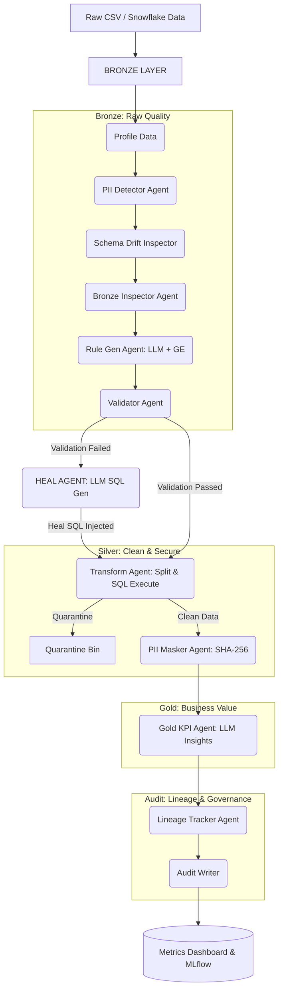

# Olist Agentic Pipeline: Architecture Plan

This document provides a comprehensive architectural breakdown of the Continuous Data Quality Pipeline. You can use this to build your final architecture diagrams for your presentation.

## 1. High-Level System Architecture

The pipeline is modeled as a **Directed Acyclic Graph (DAG)** governed by **LangGraph**. It processes raw e-commerce data through the Medallion Architecture (Bronze -> Silver -> Gold), utilizing specialized AI agents at each stage to ensure data quality, privacy, and automatic self-healing.

---

## 2. Agent-Specific Architectures

Below is the detailed architectural breakdown of each individual agent to help you design their specific internal diagrams.

### A. The Schema Drift Semantic Engine
**Role**: Detects if incoming data structure has mutated.
**Architecture**: 
1. **Baseline Comparison**: Compares incoming columns against the established `metadata/schemas/` baseline.
2. **Layer-3 Semantic Engine**: Instead of relying purely on Pandas data types, it uses a custom `_detect_semantic_type` heuristic engine.
3. **Typing**: Dynamically maps string data to semantic types (`EMAIL`, `PHONE`, `TIMESTAMP`, `INTEGER`).
4. **Output**: Flags `COLUMN_ADDED`, `COLUMN_REMOVED`, or `SEMANTIC_TYPE_CHANGED` events.

### B. Rule Generation Agent
**Role**: Dynamically writes data quality rules based on context.
**Architecture**:
1. **Input**: Receives pipeline state, schema, and sample rows.
2. **LLM Prompting**: Injects context into the LLM (Llama 3.3).
3. **JSON Output Formulation**: Forces the LLM to output a strict JSON array of **Great Expectations** configurations.
4. **Fallback mechanism**: If the LLM generates invalid JSON, the Heal Agent triggers a `Strict Mode` retry.

### C. The Validator Agent
**Role**: Executes the Great Expectations (GE) rules.
**Architecture**:
1. **In-Memory Context**: Builds a GE Ephemeral Data Context.
2. **Execution**: Applies the JSON rules to the Pandas DataFrame.
3. **Routing Decision**: 
   - If `Success == True` → Proceed to Silver Layer.
   - If `Success == False` → Route directly to the **Heal Agent**.

### D. The Heal Agent (Self-Healing Architecture)
**Role**: The emergency responder that dynamically fixes broken data.
**Architecture**:
1. **Error Classification**: Parses GE failure logs or Python exceptions.
2. **LLM SQL Generation**: Analyzes the failed rows and prompts the LLM to generate a specific Snowflake `UPDATE/DELETE` SQL statement (or Pandas equivalent) to fix the bad data.
3. **State Injection**: Injects the generated SQL into the `State["fix_sql"]` variable.
4. **Looping**: Routes the pipeline back to the Validator to re-test the fixed data.

### E. Transform Agent
**Role**: Applies the Heals and enforces Olist business rules.
**Architecture**:
1. **SQL Execution**: Executes the `fix_sql` provided by the Heal Agent to repair the raw data.
2. **Splitting**: Separates rows that passed validation (`clean_df`) from those that failed repeatedly (`quarantine_df`).
3. **Deduplication**: Drops exact duplicate rows globally across the dataset.
4. **Olist Imputation**: Safely fills missing values (e.g., `product_category_name = "UNKNOWN"`).

### F. PII Cascade Detection Agent
**Role**: Identifies sensitive Personal Identifiable Information without sending raw data to external servers.
**Architecture (The Cascade Strategy)**:
1. **Layer 1 (Heuristics)**: Checks exact column names (e.g., `cpf`, `email`, `ssn`).
2. **Layer 2 (Regex)**: Scans values using regular expressions (e.g., `^\+?[0-9\-\s\(\)]{7,15}$`).
3. **Layer 3 (Pre-Trained NLP)**: Runs Microsoft Presidio Analyzer (Local SpaCy model) to detect `PERSON`, `EMAIL_ADDRESS`, `CREDIT_CARD`.
4. **Layer 4 (LLM Fallback)**: If layers 1-3 fail, it sends *only the column name and data type* (No raw data) to the LLM for classification.
5. **Output**: Generates a mapping of `HIGH`, `MEDIUM`, `LOW`, `NONE` sensitivity per column.

### G. Gold KPI Agent
**Role**: Aggregates final metrics and generates business insights.
**Architecture**:
1. **Aggregation**: Calculates Total Revenue, Average Order Value, and Data Quality Yield.
2. **LLM Insight Generation**: Sends the aggregated KPIs to the LLM to write a 2-3 sentence executive business summary.
3. **Output**: Injects KPIs and Insights into the State for the UI Dashboard.

### H. Audit & Lineage Agents
**Role**: Maintains full transparency and governance.
**Architecture**:
1. **Lineage Tracker**: Records Data provenance (Original File -> Clean File -> Quarantine File -> Masked File).
2. **Audit Writer**: Extracts metrics (Raw count, Masked count, Duplicates dropped, Heal events) and commits the final transaction to the `metadata/batch_history.json` database.
